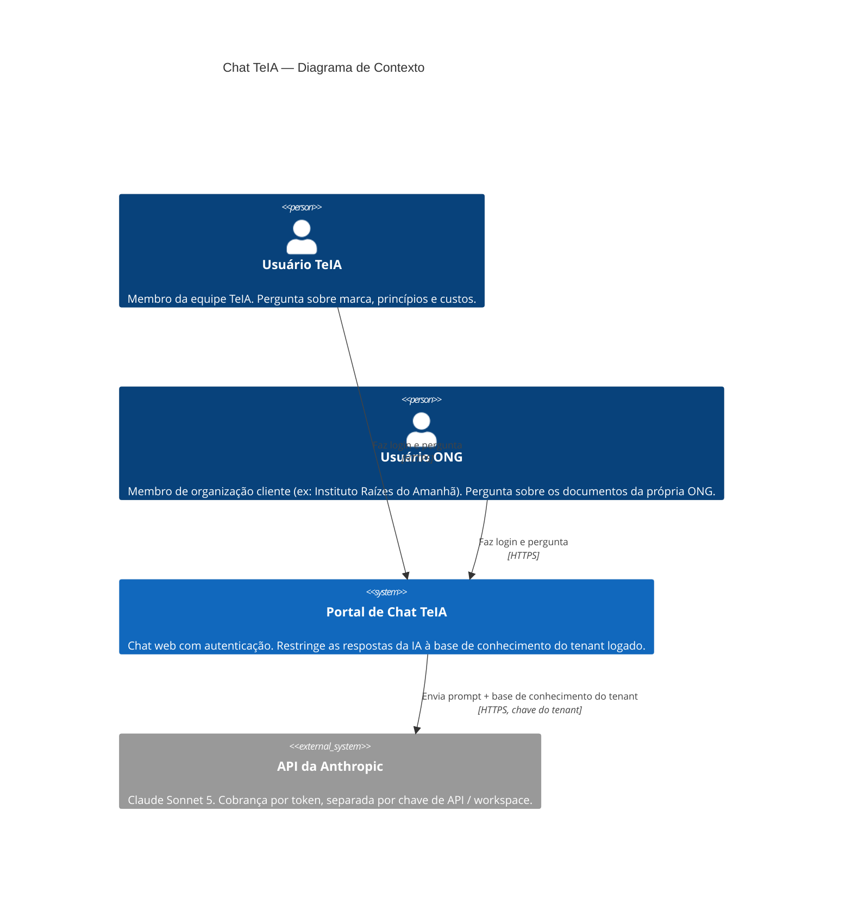
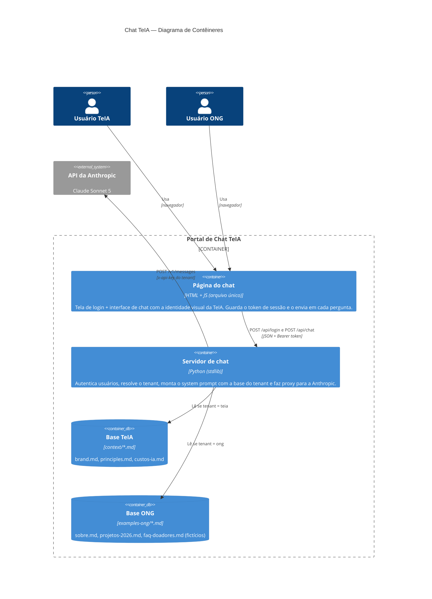
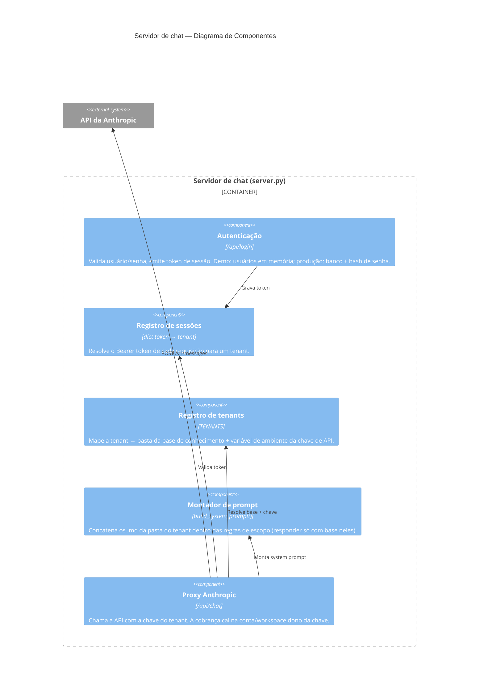

# Arquitetura do Chat TeIA — Modelo C4

> Diagramas em Mermaid (renderizam direto no GitHub). Descrevem a arquitetura multi-tenant do portal de chat: cada organização autenticada conversa apenas com a sua própria base de conhecimento, e o custo de IA é roteado para a conta/chave daquela organização.
>
> Os diagramas abaixo descrevem a **demo original** (`chat-research/`). A versão de produção (v1) está implementada em [`server/`](../server/) — mesma arquitetura de tenants, com autenticação por senha/Google, banco de dados, cotas e painel administrativo; ver a tabela [Do demo para produção](#do-demo-para-produção) e o [server/README.md](../server/README.md).

---

## Nível 1 — Contexto

Quem usa o sistema e com o que ele conversa.

**Ponto-chave do desenho**: o portal decide, *depois* da autenticação, (a) qual base de conhecimento injetar no prompt e (b) qual chave de API usar — e é a chave que determina em qual conta/workspace da Anthropic a cobrança cai.

---

## Nível 2 — Contêineres

As peças que compõem o portal.

---

## Nível 3 — Componentes do servidor

O que acontece dentro do servidor a cada requisição.

---

## Fluxo de uma pergunta (resumo)

1. Usuário faz login (`POST /api/login`) → servidor valida e devolve um **token de sessão**.
2. Cada pergunta (`POST /api/chat`) leva o token no header `Authorization: Bearer`.
3. O servidor resolve o token → tenant → **pasta de conhecimento** (`context/` ou `examples-ong/`) e **chave de API** (`ANTHROPIC_API_KEY_TEIA` ou `ANTHROPIC_API_KEY_ONG`).
4. Monta o system prompt só com os documentos daquele tenant e chama a Anthropic com a chave daquele tenant.
5. A cobrança aparece no dashboard da conta/workspace dono da chave — cada "torre" paga o seu consumo.

## Do demo para produção

| Aspecto | Demo (`chat-research/`) | Servidor v1 (`server/`) — implementado | Próximos passos |
|---|---|---|---|
| Usuários e senhas | Hardcoded em `TENANTS`, texto puro | Banco de dados com hash **argon2** + **login com Google** (OIDC + PKCE, só e-mails convidados) | SSO corporativo se algum cliente exigir |
| Sessões | Dict em memória (some no restart) | JWT de acesso (15 min) + refresh token revogável/rotacionado no banco, cookie HttpOnly | — |
| Papéis e permissões | Inexistente | `admin` (painel, gestão, métricas) e `member` (só o chat do tenant), verificados no servidor | Papéis adicionais conforme a operação crescer |
| Proteção de uso de IA | Inexistente | Rate limit por IP (login) e por usuário (chat), cotas por usuário/dia e tenant/mês (mensagens e US$), limite de payload, truncamento de histórico | Redis para rate limit quando houver múltiplas instâncias |
| Observabilidade | Inexistente | `usage_events` por chamada (tokens, custo, latência) + painel `/admin` dinâmico | — |
| Chaves de API | Variáveis de ambiente no `.env` | Idem — cada organização aponta o **nome** da env var; a chave nunca vai ao banco | Secrets manager |
| Separação de cobrança | 1 env var por tenant | Idem + custo estimado por tenant visível no painel | 1 workspace Anthropic por cliente — ver [context/custos-ia.md](../context/custos-ia.md) |
| Banco de dados | Inexistente | PostgreSQL 16 via Docker Compose (SQLite em dev), migrations Alembic | — |
| Base de conhecimento | Pastas de `.md` no repositório | Idem (pasta por organização, registrada no banco) | Storage por cliente, com upload/gestão pelo próprio cliente |
| Transporte | HTTP local | HTTP local + [`server/nginx.example.conf`](../server/nginx.example.conf) para produção | HTTPS atrás de proxy reverso + serviço de borda (DDoS) |

Alinhado ao princípio de **soberania de dados** ([principles.md](../context/principles.md)): no desenho de produção recomendado, cada organização cliente é dona da própria conta Anthropic e dos próprios documentos — a TeIA orquestra, não centraliza.
