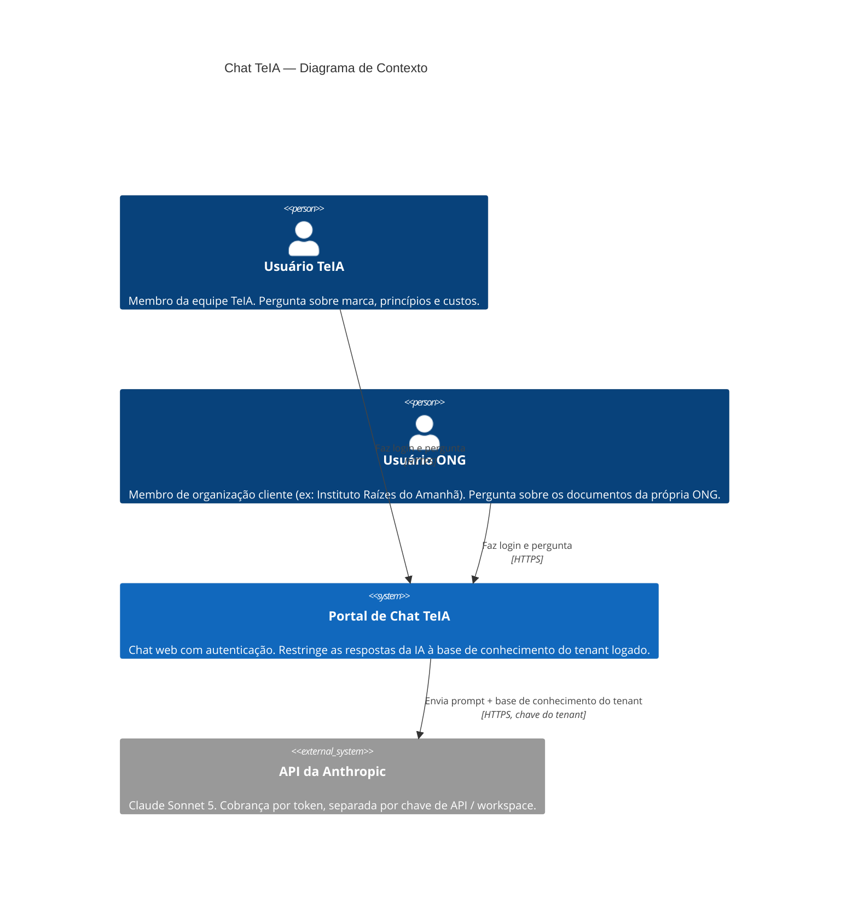
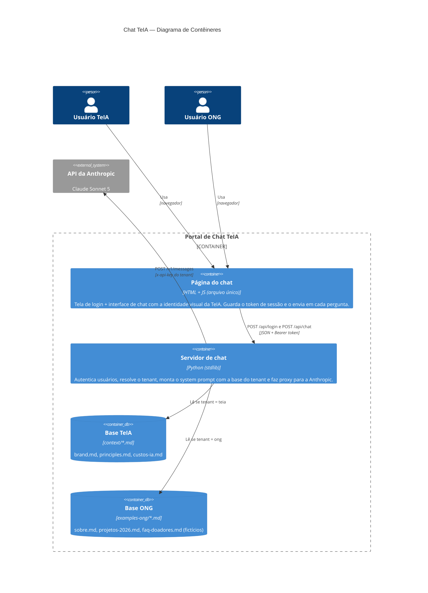
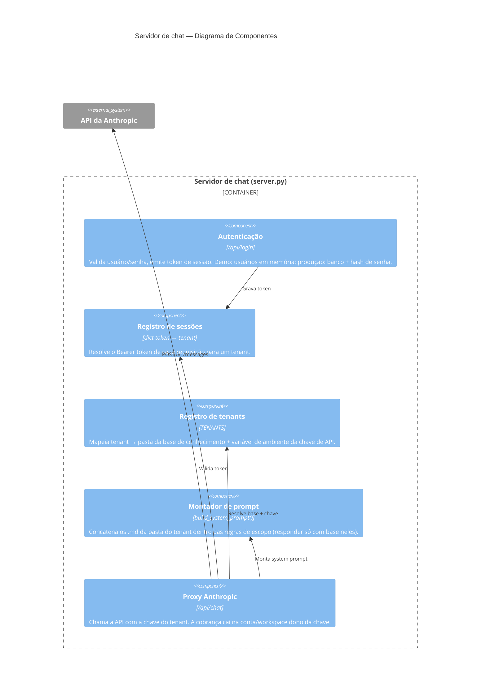

# Arquitetura do Chat TeIA — Modelo C4

> Diagramas em Mermaid (renderizam direto no GitHub). Descrevem a arquitetura multi-tenant do portal de chat: cada organização autenticada conversa apenas com a sua própria base de conhecimento, e o custo de IA é roteado para a conta/chave daquela organização.

---

## Nível 1 — Contexto

Quem usa o sistema e com o que ele conversa.

**Ponto-chave do desenho**: o portal decide, *depois* da autenticação, (a) qual base de conhecimento injetar no prompt e (b) qual chave de API usar — e é a chave que determina em qual conta/workspace da Anthropic a cobrança cai.

---

## Nível 2 — Contêineres

As peças que compõem o portal.

---

## Nível 3 — Componentes do servidor

O que acontece dentro do servidor a cada requisição.

---

## Fluxo de uma pergunta (resumo)

1. Usuário faz login (`POST /api/login`) → servidor valida e devolve um **token de sessão**.
2. Cada pergunta (`POST /api/chat`) leva o token no header `Authorization: Bearer`.
3. O servidor resolve o token → tenant → **pasta de conhecimento** (`context/` ou `examples-ong/`) e **chave de API** (`ANTHROPIC_API_KEY_TEIA` ou `ANTHROPIC_API_KEY_ONG`).
4. Monta o system prompt só com os documentos daquele tenant e chama a Anthropic com a chave daquele tenant.
5. A cobrança aparece no dashboard da conta/workspace dono da chave — cada "torre" paga o seu consumo.

## Do demo para produção

| Aspecto | Demo (este repositório) | Produção |
|---|---|---|
| Usuários e senhas | Hardcoded em `TENANTS`, texto puro | Banco de dados com hash (bcrypt/argon2) ou SSO/OAuth |
| Sessões | Dict em memória (some no restart) | JWT com expiração, ou store externo (Redis) |
| Chaves de API | Variáveis de ambiente no `.env` | Secrets manager, uma chave por cliente |
| Separação de cobrança | 1 env var por tenant | 1 workspace (ou conta) Anthropic por cliente — ver [context/custos-ia.md](../context/custos-ia.md) |
| Base de conhecimento | Pastas de `.md` no repositório | Storage por cliente, com upload/gestão pelo próprio cliente |
| Transporte | HTTP local | HTTPS atrás de proxy reverso |

Alinhado ao princípio de **soberania de dados** ([principles.md](../context/principles.md)): no desenho de produção recomendado, cada organização cliente é dona da própria conta Anthropic e dos próprios documentos — a TeIA orquestra, não centraliza.
